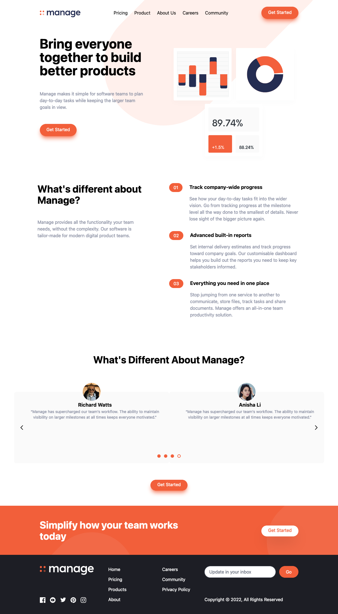

# Frontend Mentor - Manage landing page solution

This is a solution to the [Manage landing page challenge on Frontend Mentor](https://www.frontendmentor.io/challenges/manage-landing-page-SLXqC6P5). Frontend Mentor challenges help you improve your coding skills by building realistic projects.

## Table of contents

- [Overview](#overview)
  - [The challenge](#the-challenge)
  - [Screenshot](#screenshot)
  - [Links](#links)
- [My process](#my-process)
  - [Built with](#built-with)
  - [What I learned](#what-i-learned)
  - [Useful resources](#useful-resources)
- [Author](#author)

## Overview

### The challenge

Users should be able to:

- View the optimal layout for the site depending on their device's screen size
- See hover states for all interactive elements on the page
- See all testimonials in a horizontal slider
- Receive an error message when the newsletter sign up `form` is submitted if:
  - The `input` field is empty
  - The email address is not formatted correctly

### Screenshot



### Links

- [Frontend Mentor Solution](https://your-solution-url.com)
- [Live Site](https://antonio-fm-landing-page.netlify.app/)

## My process

### Built with

- [React](https://reactjs.org/) - JS library
- [Tailwind CSS](https://tailwindcss.com/) - A utility-first CSS framework for rapidly building custom user interfaces.
- [Flowbite](https://flowbite.com/) - Open-source component library built around Tailwind CSS

### What I learned

Creating a carousel by hand was complicated given the fact I was working with Tailwind CSS. Luckily I found a library that comes with built in components that can be configured to one's needs. Adding my testimonial cards inside the carousel was easy enough.

```
<div
	data-carousel-item=''
	className='stlying configuration'
>
// testimonial card
</div>
```

Styling the carousel was the challenging part and couldn't replicate the sample design.

### Useful resources

- [Flowbite Carousel Docs](https://flowbite.com/docs/components/carousel/) - This helped me configure the carousel and add the testimonials section
- [Tailwind CSS Docs](https://tailwindcss.com/docs/installation) - The official Tailwind CSS documentation

## Author

👤 **Antonio Lopez**

- Website: [Antonio Lopez](https://www.antoniolopez.me/)
- Github: [@antonio-lopez](https://github.com/antonio-lopez)
- Frontend Mentor: [@antonio-lopez](https://www.frontendmentor.io/profile/antonio-lopez)
